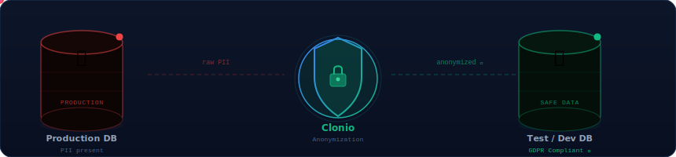

<div align="center">
  
</div>

<br>

<div align="center">

[](https://robert-kummer.de)
[](https://clonio.dev)
[](https://php-script.github.io/php-script/)
[](https://robert-kummer.de)

</div>

---

## About

Senior **Laravel** developer with 25 years of hands-on PHP experience — starting from PHP 3 in 2001, falling in love with **Laravel 4**, and building production-grade SaaS tools ever since. My stack of choice is **Laravel + Inertia.js + Vue.js**, combining a rock-solid PHP backend with a seamless, reactive frontend — no full-page reloads, no REST overhead.

I believe software should be crafted, not just shipped. Every package, every feature, every line of code is an opportunity to leave things better than you found them.

---

## 🛡️ Clonio — GDPR-Compliant Database Cloning

> **Self-hosted tool that creates anonymized copies of your production database for dev, test & staging — with PII never leaving your infrastructure boundary.**

<div align="center">
  
</div>

<br>

<table>
<tr>
<td width="50%" valign="top">

**Key Features**

- 🔄 Column-level transformations *(keep / static / random / format-preserving)*
- 🧠 Schema-aware — handles added, removed, renamed columns
- 🔑 Foreign key awareness during row selection
- 📋 Cryptographically signed audit logs *(HMAC-SHA256)*
- ⚙️ REST API trigger + CI/CD integrations *(GitHub Actions, GitLab CI, Jenkins…)*
- 🏠 Fully self-hosted — no cloud, no external data transmission

</td>
<td width="50%" valign="top">

**Supported Databases**

| Database | Status |
|---|---|
| PostgreSQL | ✅ Supported |
| MySQL | ✅ Supported |
| MariaDB | ✅ Supported |
| MS SQL Server | ✅ Supported |

**Tech Stack:** PHP 8.4+ · Laravel · Vue 3 · Inertia.js · Tailwind · Pest

</td>
</tr>
</table>

<table>
<tr>
<td align="center" width="33%">
<strong>Community</strong><br><br>
<code>Free forever</code><br>
<sub>Students · OSS · NGOs · Personal</sub>
</td>
<td align="center" width="33%">
<strong>Business</strong><br><br>
<code>€39 / month</code><br>
<sub>Up to €1M annual revenue</sub>
</td>
<td align="center" width="33%">
<strong>Enterprise</strong><br><br>
<code>€99 / month</code><br>
<sub>Unlimited revenue · Priority support</sub>
</td>
</tr>
</table>

🌐 **[clonio.dev](https://clonio.dev)** &nbsp;·&nbsp; 📦 **[github.com/clonio-dev/clonio](https://github.com/clonio-dev/clonio)** &nbsp;·&nbsp; `v1.0.1`

---

## ⚡ PHP Script — Embedded Scripting Language for PHP

> **A scripting language with JavaScript-like syntax that runs sandboxed inside PHP — let your users write automation and business logic without exposing raw PHP or spinning up Node.js.**

<table>
<tr>
<td width="50%" valign="top">

**Features**

- 🧩 JavaScript-inspired syntax — familiar to any developer
- 🔒 Sandboxed & whitelisted — full control over exposed functions
- 🌳 AST-based engine — both PHP & PHP Script render from the same AST
- 🎨 Monaco editor integration — Monarch language definition included
- ⏱️ Configurable execution time limits
- 🧪 100% test coverage via Pest

**Roadmap**
- Mermaid.js AST flowcharts
- Monaco components for Vue.js / React / Vanilla JS

</td>
<td width="50%" valign="top">

**Script Syntax**

```javascript
// Greet the user
echo 'Hello ' + user.name;

// Business logic
totalLogins = user.logins.count();
score = totalLogins * 10 + user.bonus;

if (score > 500) {
    echo 'Power user!';
}

// Loop through data
foreach (users_list as u) {
    echo '- ' + u;
}

// Permission gates
if (user.hasPermission('admin')) {
    echo 'Access granted!';
}
```

</td>
</tr>
<tr>
<td colspan="2">

**PHP Integration**

```php
use PhpScript\Core\Engine;

$engine = new Engine();
$engine->set('user', new User());          // expose a PHP object
$engine->set('users_list', $users);        // expose an array
$engine->setExecutionTimeLimit(5);         // prevent infinite loops

echo $engine->execute($userScript);        // PII stays yours, logic stays theirs
```

</td>
</tr>
</table>

📖 **[Documentation](https://php-script.github.io/php-script/)** &nbsp;·&nbsp; 📦 **[github.com/php-script/php-script](https://github.com/php-script/php-script)** &nbsp;·&nbsp; `v1.0.3` &nbsp;·&nbsp; 232 commits · 4 contributors

---

## 🔧 Tech Stack

<div align="center">


</div>

---

## 📦 Open Source Packages

| Package | Description | Lang | ⭐ |
|---|---|---|---|
| [laravel-starter-kit](https://github.com/rokde/laravel-starter-kit) | Laravel Starter Kit with DDD and built-in SaaS features | Vue | 5 |
| [laravel-subscription-manager](https://github.com/rokde/laravel-subscription-manager) | Complete subscription management for Laravel | PHP | 9 |
| [number-generator](https://github.com/rokde/number-generator) | Invoice/customer number generator with placeholders | PHP | 2 |
| [laravel-pergament](https://github.com/rokde/laravel-pergament) | File-based CMS for Laravel — Markdown + YAML front matter | PHP | — |
| [state-machine](https://github.com/rokde/state-machine) | Generic, framework-agnostic state machine in PHP | PHP | — |
| [laravel-clone-database-command](https://github.com/rokde/laravel-clone-database-command) | Clone a database with value overwriting *(Clonio origin)* | PHP | — |
| [laravel-utilities](https://github.com/rokde/laravel-utilities) | PHP & Laravel utility collection | PHP | — |
| [laravel-buymeacoffee-webhook-handler](https://github.com/rokde/laravel-buymeacoffee-webhook-handler) | Buy Me a Coffee webhook handler for Laravel | PHP | — |

---

## 🗺️ 25 Years of PHP

```
2001 ──────────────── PHP 3 · first lines of code
2004–2008 ──────────── PHP 4 & 5 · custom CMS & web applications
2010 ───────────────── @ipunkt · open source collaboration begins
2013 ───────────────── Laravel 4 · fell in love, never looked back
2015–2018 ──────────── open source packages · subscriptions, state machines
2019 ───────────────── Inertia.js + Vue 3 · the perfect Laravel combo
2022 ───────────────── founded Robert Kummer IT
2024 ───────────────── laravel-starter-kit · DDD architecture for SaaS
2025 ───────────────── PHP Script · embedded scripting language for PHP apps
2026 ───────────────── Clonio v1.0 · GDPR-compliant DB cloning for teams
```

---

### GitHub Achievements

🦈 Pull Shark ×3 &nbsp;·&nbsp; 👥 Pair Extraordinaire &nbsp;·&nbsp; ⚡ Quickdraw &nbsp;·&nbsp; 🌍 Arctic Code Vault Contributor &nbsp;·&nbsp; ⭐ Starstruck

---

<div align="center">

**Robert Kummer IT** · Hohenstaufenstraße 35 · 10779 Berlin

[robert-kummer.de](https://robert-kummer.de) &nbsp;·&nbsp; [post@robert-kummer.de](mailto:post@robert-kummer.de) &nbsp;·&nbsp; [clonio.dev](https://clonio.dev) &nbsp;·&nbsp; [php-script docs](https://php-script.github.io/php-script/)

<sub>Crafting software since 2001</sub>

</div>
